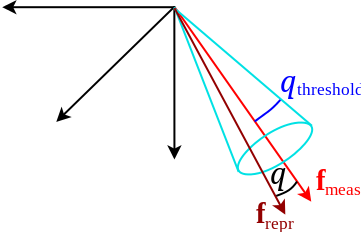

# [OpenGV](https://github.com/laurentkneip/opengv) メモ

ここの内容は基本[ここ](https://laurentkneip.github.io/opengv/page_how_to_use.html) の内容。

## 基本用語
- Bearing vector

カメラ座標系での単位ベクトルで３次元ポイント方向を指す。
よって２自由度。カメラ座標系での定義が多い。
単位ベクトルなので位置を表すわけではなさそう。

単位球面にLandmark位置を投影した形になるので、VINS-Monoと同じ扱いをしている。
カメラモデルとの関係では、画像自体が平面に補正できなくても、特徴点位置のみが補正して、
単位球面上に観測Feature point位置を投影できればOK。

- Landmark

３次元の点を示す。
この用語だと、世界座標系（world reference frame）での３次元点を示すことが多い。

- Camera

OpenGVではキャリブレーションされたカメラしか登場しないので、
Landmarkの観測結果は、Bearing vectorとカメラ座標系の定義だけから表現することができる。

なので、Bearing vectorのところでも書いたけど、全ての観測結果は、カメラ座標系の
原点を中心とした単位球面上に存在することになる。

- Viewpoint

複数カメラを扱えるようにする概念。
VPを利用すると、VP座標系とVPに含まれるカメラ座標系、それぞれのカメラ座標系における
観測を表現するBearing vectorからOpenGVが構成されることになる。
シングルカメラも厳密には、VP座標系とカメラ座標系が一致している状態として表現される。
マルチカメラリグなど表現できるのでいつか使ってみたい。

- Pose

ViewpointのPositionとOrientationを、固定した参照座標系上で定義したもの。
参照座標系は、世界座標系か、ほかのViewpointを使って相対的なPoseを表現してもよし。

- Absolute Pose

世界座標系で定義されるPoseを示す。

- Relative Pose

ほかViewpointからの相対的Poseを示す。

- Correspondence

同じLandmarkを示す対応のこと。以下の対応がある。
複数Viewpoint間のBearing vectorの対応（2D-2D）、
Bearing vectorと３次元点の対応（2D-3D）、
異なる座標系間の３次元点の対応（3D-3D）

## ライブラリの使い方

1. Adapterを用意

OpenGV利用の第一歩は"Adapter"。これに、Bearing vectorやCorrespondenceなどの参照を渡しておけば、
OpenGV側がかってにアクセスするようになる。

OpenGVは設定されたAdapterを通してBering vectorとかCorrespondenceにアクセスする。
標準で設定されているAdapterはOpenGVの型をそのままバイパスするだけ。OpenCVや独自て定義した型は、専用にAdapterを作ればバイパスすることができる。

例：5point ransacなどの利用を想定して、２セットの対応関係の取れたBearing vectorを設定する。
```c++
// create the central relative adapter
relative_pose::CentralRelativeAdapter adapter(bearingVectors1, bearingVectors2 );
```

2. RANSAC + 5point algorithmを構築する

```c++
// create a RANSAC object
sac::Ransac<sac_problems::relative_pose::CentralRelativePoseSacProblem> ransac;
// create a CentralRelativePoseSacProblem
// (set algorithm to STEWENIUS, NISTER, SEVENPT, or EIGHTPT)
std::shared_ptr<sac_problems::relative_pose::CentralRelativePoseSacProblem>
    relposeproblem_ptr(
    new sac_problems::relative_pose::CentralRelativePoseSacProblem(
    adapter, // ここに入力情報へのAdapterを設定
    sac_problems::relative_pose::CentralRelativePoseSacProblem::NISTER // ここに5pointの手法を選択 
) );
// run ransac
ransac.sac_model_ = relposeproblem_ptr; // problemをRANSACに設定
ransac.threshold_ = threshold; // RANSACのしきい値
ransac.max_iterations_ = maxIterations; // MAX繰り返し回数
ransac.computeModel(); // run ransac
// get the result
transformation_t best_transformation =
    ransac.model_coefficients_;
```

## RANSACのしきい値設定について
↓みたいな感じでRANSACのしきい値を設定する。このときのしきい値計算方法について。
```c++
ransac.threshold_ = threshold;
```

答え： `ransac.threshold_ = 1.0 - cos(許容Bearing angle角度[rad]);`

詳細：
OpenGV内の多くの実装ではReprojection誤差をBearing vectorとreprojectしたbearing vectorの内積から計算している。
ただし、内積は、誤差なしで1、真反対で-1になって0が最小値になっていない。
なので、`error = 1 - inner_product`をReprojection errorとしている。
よって、しきい値も、`1.0 - cos(許容Bearing angle角度[rad])`で計算する。

